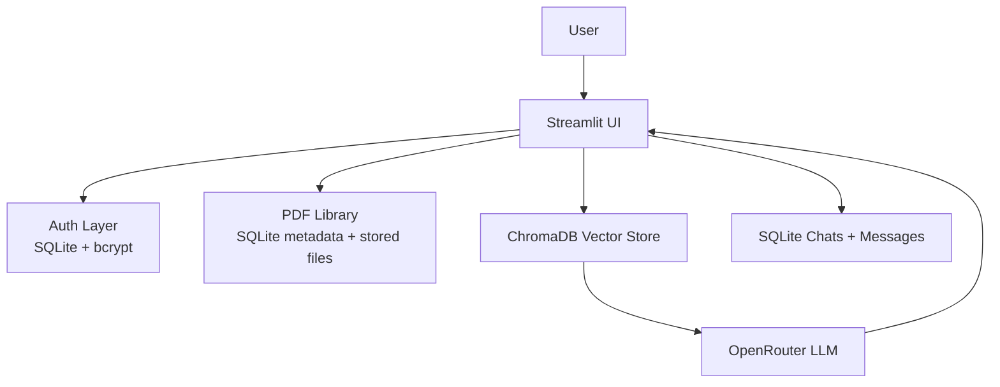

# Multi-PDF RAG Chatbot..

AI Document Intelligence Platform for chatting with multiple PDFs using OpenRouter, ChromaDB, and a persistent SQLite-backed PDF library.

## Live Demo

Live URL: https://your-app-url

## Screenshots

Add screenshots here after deployment:

- `assets/screenshots/login.png`
- `assets/screenshots/dashboard.png`
- `assets/screenshots/chat.png`

## Features

- Login and signup with bcrypt password hashing
- Multi-PDF upload with personal PDF library
- Select specific PDFs for each chat
- ChromaDB vector search across uploaded documents
- OpenRouter responses with source citations
- Chat history saved per user in SQLite
- Conversation memory for follow-up questions
- ChatGPT-style UI with avatars and dark theme

## Architecture



## Tech Stack

- Frontend: Streamlit
- Backend: Python
- AI: LangChain, OpenRouter
- Vector DB: ChromaDB
- Database: SQLite
- Authentication: bcrypt
- Deployment: Render

## Installation

### 1. Create and activate a virtual environment

```powershell
python -m venv venv
venv\Scripts\Activate.ps1
```

### 2. Install dependencies

```powershell
pip install -r requirements.txt
```

### 3. Set up environment variables

Create a `.env` file:

```env
OPENROUTER_API_KEY=your_openrouter_api_key
```

### 4. Run the app locally

```powershell
streamlit run app.py
```

## Deployment on Render

This repository includes `render.yaml` for a Streamlit web service.

1. Push the repo to GitHub.
2. Create a new Render Web Service from the repo.
3. Add `OPENROUTER_API_KEY` as an environment variable in Render.
4. Deploy using the provided `render.yaml` or the Render dashboard.

### Important note

Render free-tier instances do not provide durable local storage, so SQLite data, uploaded PDFs, and ChromaDB indexes can be lost on restart or redeploy. For a demo, this is acceptable. For production, move to PostgreSQL and cloud storage.

## Testing

```powershell
python -m py_compile app.py db.py
```

## Project Structure

- `app.py` - Streamlit application
- `db.py` - SQLite helper functions
- `requirements.txt` - Python dependencies
- `render.yaml` - Render deployment config

## Notes

- Uploaded PDFs are stored in `pdf_library/` per user.
- Existing chats can be reopened from the sidebar.
- Chat answers include cited PDF sources and page numbers.

## License

MIT
