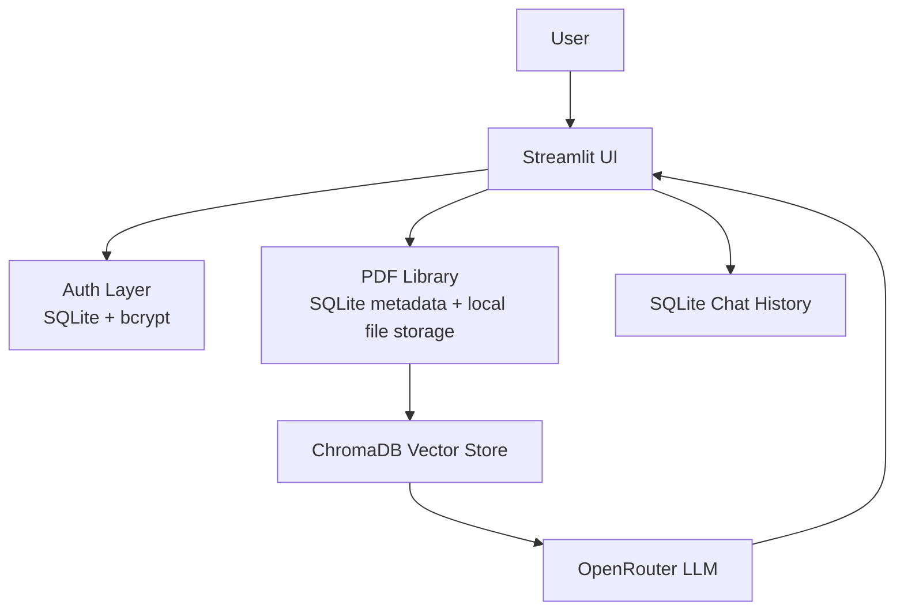

# Multi-PDF RAG Chatbot

AI document assistant for chatting with multiple PDFs using Streamlit, LangChain, OpenRouter, ChromaDB, and SQLite-backed personal libraries.

## Project Overview

This project lets each user:

- sign up and log in securely with bcrypt password hashing
- upload multiple PDF files into a personal library
- choose which documents are active for a chat
- ask questions across the selected PDF set
- receive grounded answers with source citations and page references
- continue conversations with per-user chat history and memory

## Rating

6.5/10 — solid learning and portfolio project, but not yet production-grade.

## What works well

- Feature scope is broader than a basic upload-and-chat demo: auth, multi-user library, chats, and citations are all included.
- The stack is sensible for a RAG prototype: Streamlit + LangChain + ChromaDB + OpenRouter.
- Page-level citations improve trust and explainability.
- The repo is organized into authentication, UI, PDF, and database modules instead of keeping everything in a single script.
- The README is clear enough for recruiters and reviewers to understand the project quickly.

## Key gaps

- The app still relies on local file storage and SQLite for the demo, so restarts can lose data on Render free tier.
- There are no automated tests for auth, chunking, or retrieval behavior.
- There is no live deployment or screenshot gallery yet.
- PDF upload validation is minimal and needs explicit size/type safeguards.
- The RAG chunking and embedding strategy should be documented more clearly.

## Tech Stack

- Frontend: Streamlit
- Backend: Python
- AI orchestration: LangChain
- LLM API: OpenRouter
- Embeddings: Hugging Face sentence-transformers
- Vector database: ChromaDB
- Databases: SQLite for auth, library metadata, and chat history
- Security: bcrypt
- Deployment: Render

## Architecture


```mermaid
flowchart TD
    U[User] --> S[Streamlit UI]
    S --> A[Auth Layer\nSQLite + bcrypt]
    S --> P[PDF Library\nSQLite metadata + local file storage]
    P --> V[ChromaDB Vector Store]
    V --> O[OpenRouter LLM]
    O --> S
    S --> D[SQLite Chat History]
```

## RAG Strategy

The vector store uses a recursive chunking strategy:

- chunk size: 1000 characters
- chunk overlap: 200 characters
- embedding model: all-MiniLM-L6-v2 via Hugging Face

This is configured in the RAG utility layer and is designed to balance context coverage with retrieval precision for PDF content.

## Features

- Login and signup with bcrypt password hashing
- Multi-PDF upload with a per-user library
- Selection of active PDFs for each chat
- ChromaDB retrieval across uploaded documents
- OpenRouter-powered LLM responses
- Source citations with page references
- Per-user chat history and memory for follow-up questions
- Dark-mode chat UI inspired by modern assistant products

## Installation

### 1. Create and activate a virtual environment

```powershell
python -m venv venv
venv\Scripts\Activate.ps1
```

### 2. Install dependencies

```powershell
pip install -r requirements.txt
```

### 3. Configure environment variables

Create a `.env` file in the project root:

```env
OPENROUTER_API_KEY=your_openrouter_api_key
```

### 4. Run locally

```powershell
streamlit run app.py
```

## Deployment on Render

This repo includes `render.yaml` for a Streamlit deployment.

1. Push the project to GitHub.
2. Create a new Render Web Service from that repo.
3. Add `OPENROUTER_API_KEY` in the Render environment variables.
4. Deploy using the provided configuration.

### Important note

Render free-tier storage is ephemeral. SQLite files, uploaded PDFs, and ChromaDB data can be lost after a restart or redeploy. For a demo, that is acceptable; for a production-grade deployment, move to PostgreSQL and cloud object storage.

## Security and Validation

The app includes basic file safety checks before saving uploads:

- only PDF files are accepted
- empty files are rejected
- files larger than 20 MB are rejected

This helps reduce invalid uploads and accidental storage misuse.

## Testing

The project now includes a basic pytest suite for the most critical behaviors:

```powershell
pytest -q
```

If you want a quick syntax-only check:

```powershell
python -m py_compile app.py
```

## Project Structure

```text
RAG-PDF-Chatbot/
├── app.py
├── README.md
├── requirements.txt
├── render.yaml
├── auth/
│   ├── auth.py
│   ├── password_reset.py
│   └── validators.py
├── components/
│   ├── chat_ui.py
│   ├── forgot_password.py
│   ├── landing.py
│   ├── pdf_library.py
│   ├── reset_password.py
│   └── sidebar.py
├── database/
│   └── db.py
├── services/
│   ├── ai_service.py
│   └── email_service.py
├── utils/
│   ├── pdf_utils.py
│   ├── rag_utils.py
│   └── ui_utils.py
├── assets/
│   └── pdf_library/
├── tests/
│   └── test_project_quality.py
└── chat_history.db
```

## Notes

- Uploaded PDFs are stored per user under `assets/pdf_library/user_<id>/`.
- Existing chats can be reopened from the sidebar.
- Chat answers include cited PDF sources and page numbers.
- The free-tier deployment model is fine for demo use, but not durable for production.

## License

MIT
